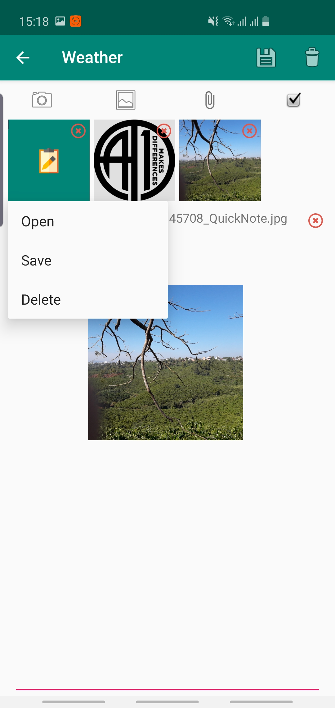

# QuickNote
A Note Taker app

This project is intended to develop a functional note taking app.

## Implemented features
* Creating new notes, viewing, updating and deleting exist notes.
    * Swipe to delete and undo in main activity.
    * Sort notes by time modified or title, ascending or descending.
    * Search notes by title, content or date modified.
* Adding text, pictures, files into notes.
    * Add images from device and camera, add files from file chooser.
    * Delete or save attachments.
    * Insert images into EditText using Spannable.
* Synchronizing data using Drive API v3:
    * Deleting notes on Drive if synced local notes have been deleted and vice versa
    * Uploading new local notes into Drive
    * Downloading notes from Drive into local database
    * Updating notes if there have been changes
* Simple, user-friendly layout.
    * Splash Screen
    * Coordinator Layout for 'Editing notes' activity.

## Planned features
* Simple, easy to use layout yet having necessary functions.
* Improved performance.

## Screenshots

| | | |
|:-------------------------:|:-------------------------:|:-------------------------:|
| Splash Screen| Empty list| Note list|
| Search for notes| Swipe to delete| Undo|
| Sort| Navigation Drawer| Synchronizting|
| Finish syncing| New note| View existed note|
| Add images to content| Options menu for attachments||
